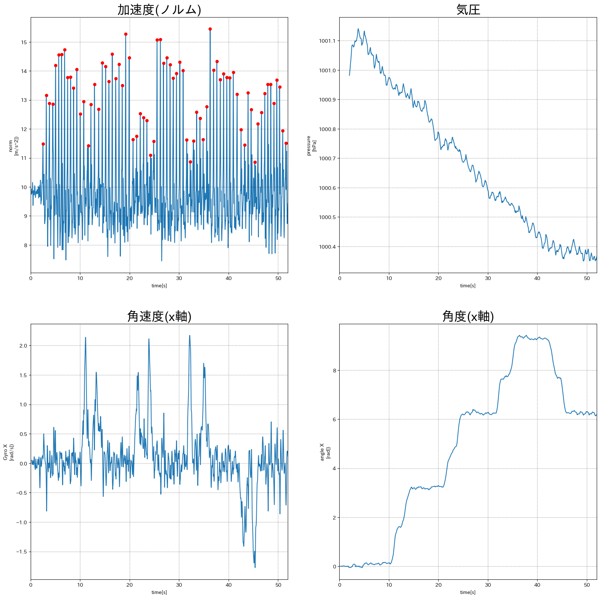
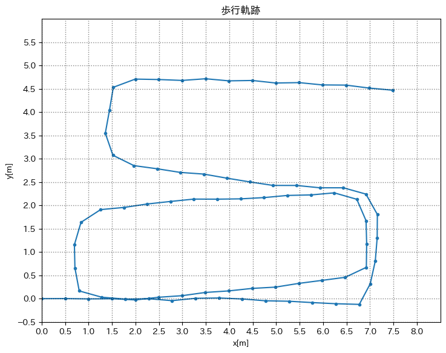
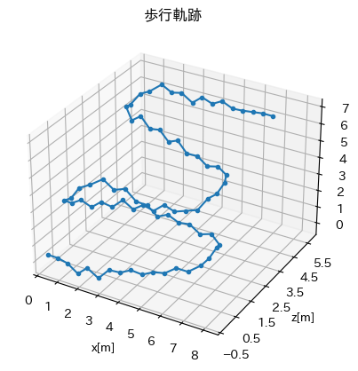
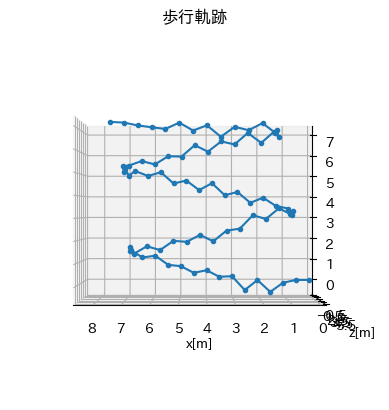
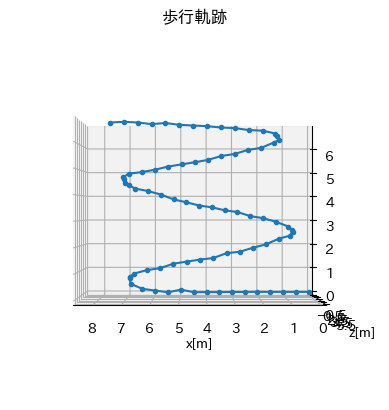
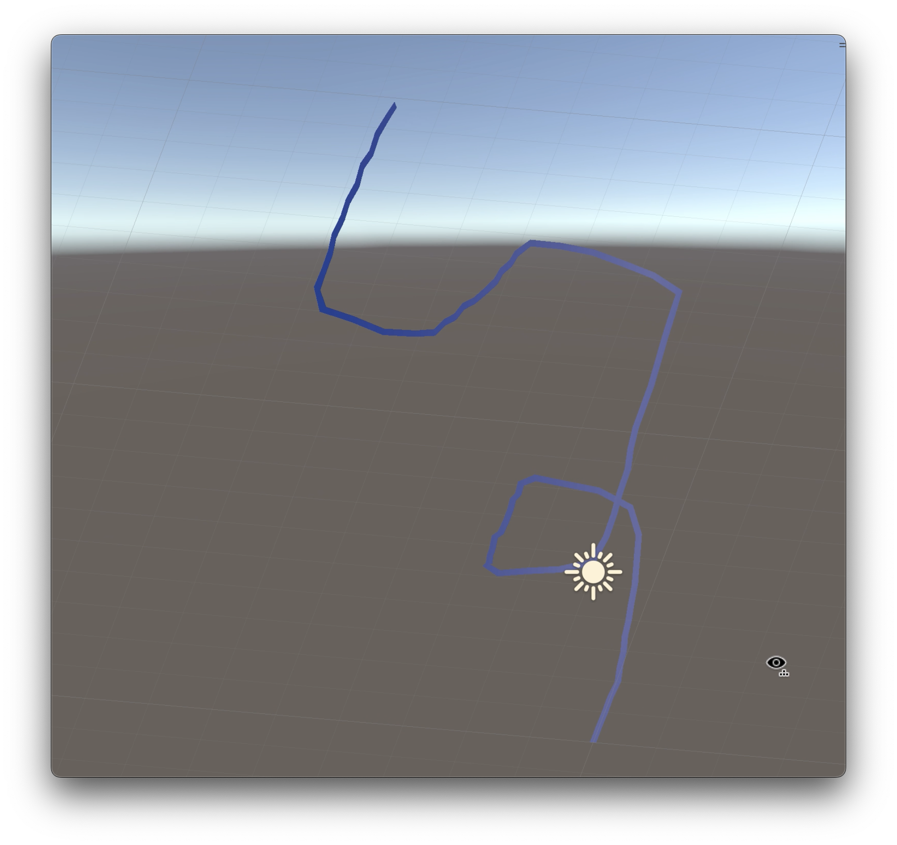

# スケジュール
- [x] 3次元の歩行軌跡
  - [x] 計測
  - [x] 二次元グラフ化
  - [x] 三次元グラフ化(Python)
  - [x] 三次元グラフ化(Unity)


# 進捗
## 計測
4号館別館の1階(階段前)から3階(トイレ前)へ


### 使用機器など
- Android  Xperia
- Phyphox
  - 加速度センサー
  - 角速度センサー
  - 気圧センサー

## 二次元グラフ化
### 各センサーの値


(前後40サンプルの移動平均フィルターをかけてある)  

### 二次元グラフ(加速度, 角速度)


1-2階と2-3階が1.5mほどずれている  
=> 階段の歩幅と平坦部の歩幅が異なるから?

## 三次元グラフ化(Python)
### 気圧から高さを出す
1気圧の環境で `1hPa` 下がると `10m` 上があるとして計算

### 三次元グラフ


### 三次元グラフ(横から)


階段を登っている様子はわかるが、沈んでしまっている(?)  
=> もっと平滑化すべき?

### 平滑化を強めた(?)グラフ




前後160サンプルで平滑化  

やりすぎだが、フィルター次第で綺麗にできる問題だと分かった


## 三次元グラフ化(Unity)
Pythonで座標をcsvで書き出して、c#で読み込む

[c#スクリプト](./lineGraph.cs)

少数16桁ある場合は `System.Globalization.NumberStyles.Float` が必要となる

```c#
float.Parse(line[0], System.Globalization.NumberStyles.Float);
```



動かしながら見れるようになった
