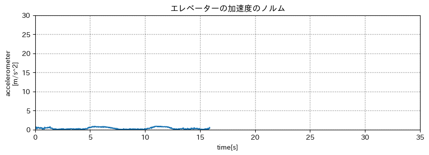
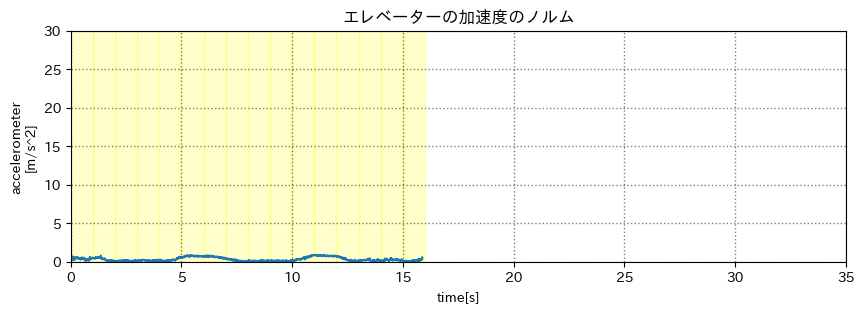
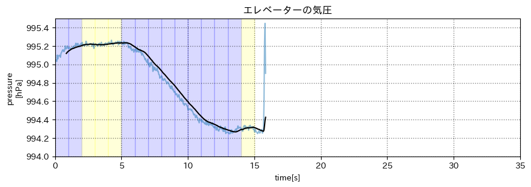
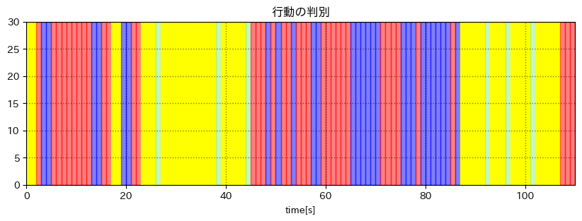
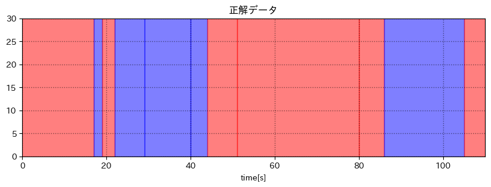
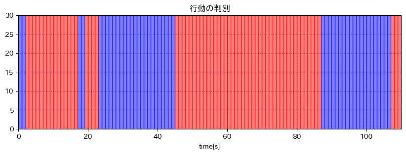
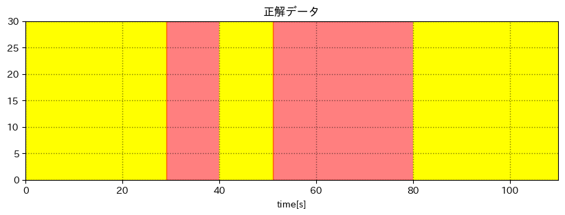
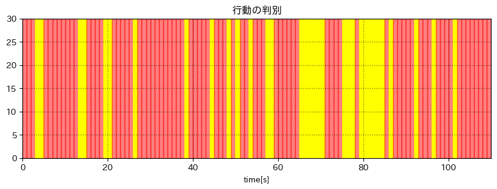

# スケジュール
## 短期的なスケジュール
- [ ] エレベーターと歩きを判別する
  - [x] データをとる
  - [x] 歩いているかを判別する
  - [x] 上り下りしているかを判別する
  - [x] エレベーターと歩きを判別する
  - [x] 正解データと比較
  - [ ] 改善
- [ ] 技育キャンプ ハッカソン
  - [ ] 7/9 キックオフ
  - [ ] 7/16 本番

# エレベーターと歩きを判別する
## データをとる
## 場所
1号館 5階-7階  

## 取り方
- 腰にポーチをつける
- Pixel5 (Android)
- Pyphox
  - 気圧センサー
  - 加速度センサー
  - 角速度センサー

## 歩いているかを判別する
### 加速度(ノルム)のグラフ

重力加速度を除いている  
> df["x"] = df["x"] - df["x"].mean()  
> df["y"] = df["y"] - df["y"].mean()  
> df["z"] = df["z"] - df["z"].mean()  

### 方法
1秒ごとに区切り、それぞれの分散を計算する

### 判別基準
分散が `0.1以上` の場合は歩いているとみなす(青色)  
`0.1未満` の場合は止まっているとみなす(黄色)  

### 色分けしたグラフ

## 上り下りしているかを判別する
### 気圧のグラフ

青 : 元のデータ  
黒 : 移動平均フィルター(前後20サンプル)

### 方法
1秒ごとに区切り、それぞれの平均を出して、一秒後との差を出す

### 判別基準
分散が `0.015以上` の場合は歩いているとみなす(青色)  
`0.015未満` の場合は止まっているとみなす(黄色)  

### 色分けしたグラフ

### 行動の判別
二つのグラフより...
- 気圧が変化している & 動いている  
  - => (赤) 階段を上る
- 気圧が変化している & 動いない  
  - => (黄) エレベーターで移動
- 気圧が変化してない & 動いている  
  - => (青) 平地を歩く
- 気圧が変化してない & 動いてない
  - => (緑) 待機

#### 階段を使った時

> 赤: 階段を上る  
> 黄: 平地を歩く  
> 青: エレベーターで移動  
> 緑: 待機  

ぽく見えるが正解が分からない  
=> 正解データを動画で残す

## 正解データと比較
データを取り直した

## 場所
お家(マンション) 1階-8階  

1. 部屋からエレベーターまで歩く  
1. エレベーターで1-5階に移動  
1. 階段で5-8階に移動  
1. (エレベーターで1階に戻る)  
1. (部屋の前まで歩く)  

## 取り方
- 腰にポーチをつける
- Pixel5 (Android)
- Pyphox
  - 気圧センサー
  - 加速度センサー
  - 角速度センサー

### 行動を判別

> 赤: 階段を上る  
> 青: 平地を歩く  
> 黄: エレベーターで移動  
> 緑: 待機  

#### 動いているか

> 赤: 動いている  
> 青: 止まっている  

#### 上り下りしているか

> 赤: 上り下りしている  
> 黄: 止まっている  

上り下りしているかが全く取れていない

TODO
- 気圧と加速度のグラフと一緒に表示する
- 上り下りの判別をより正確にする
- わかりやすい色にする

# メモ
アフィン変換  
タイムスタンプを残せるように  
lavlus
