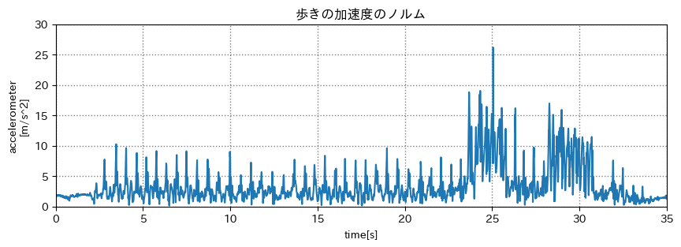
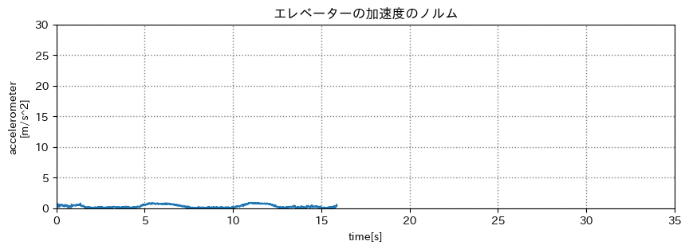
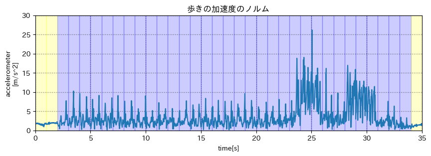
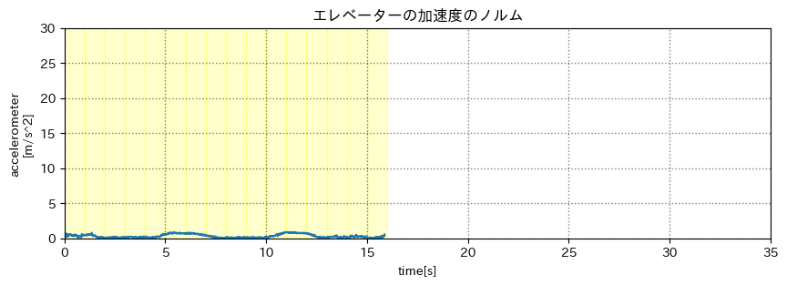
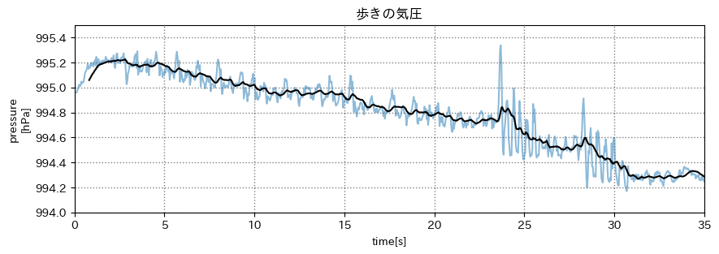
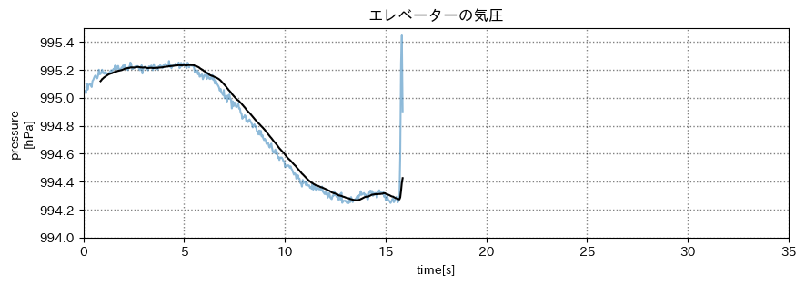
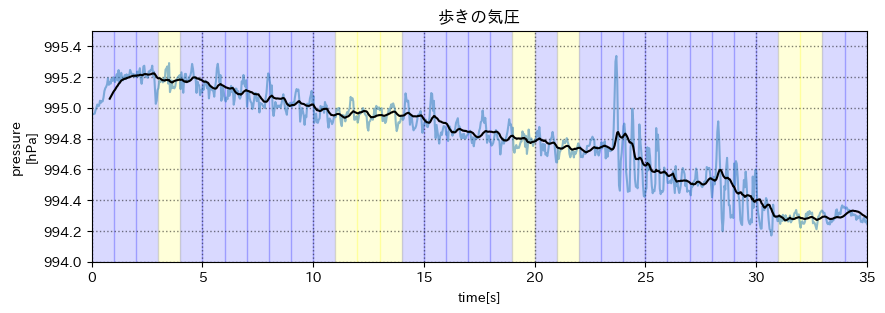
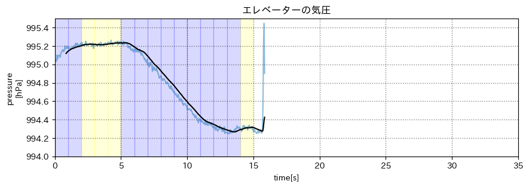

# スケジュール
## 短期的なスケジュール
- [ ] エレベーターと歩きを判別する
  - [x] データをとる
  - [x] 歩いているかを判別する
  - [x] 上下に移動しているかを判別する
  - [ ] エレベーターと歩きを判別する

# エレベーターと歩きを判別する
## データをとる
## 場所
1号館 5階-7階  

## 取り方
- 腰にポーチをつける
- Pixel5 (Android)
- Pyphox
  - 気圧センサー
  - (加速度センサー)
  - (角速度センサー)

## 歩いているかを判別する
### 加速度(ノルム)のグラフ

重力加速度を除いている  
> df["x"] = df["x"] - df["x"].mean()  
> df["y"] = df["y"] - df["y"].mean()  
> df["z"] = df["z"] - df["z"].mean()  

### 方法
1秒ごとに区切り、それぞれの分散を計算する

### 判別基準
分散が `0.1以上` の場合は歩いているとみなす(青色)  
`0.1未満` の場合は止まっているとみなす(黄色)  

### 色分けしたグラフ

## 上下に移動しているかを判別する
### 気圧のグラフ

青 : 元のデータ
黒 : 移動平均フィルター(前後20サンプル)

### 方法
4秒ごとに区切り、それぞれの分散を計算する

### 判別基準
分散が `0.1以上` の場合は歩いているとみなす(青色)  
`0.1未満` の場合は止まっているとみなす(黄色)  

### 色分けしたグラフ

大体できているが正解が分からない  
=> 正解データを動画で残す

