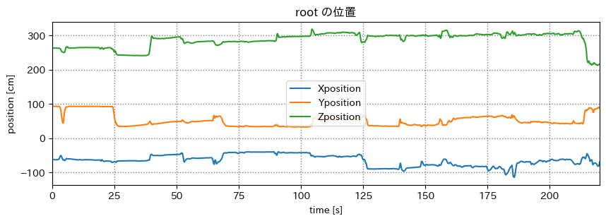
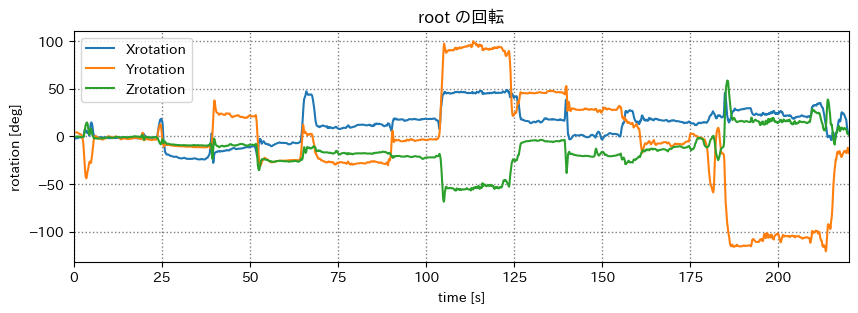
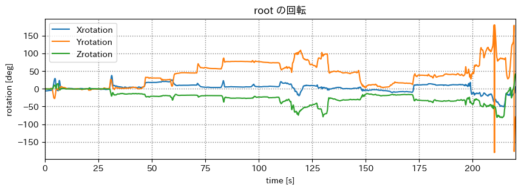
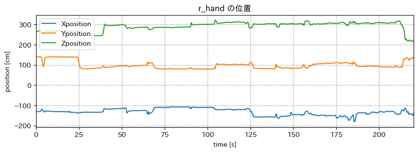
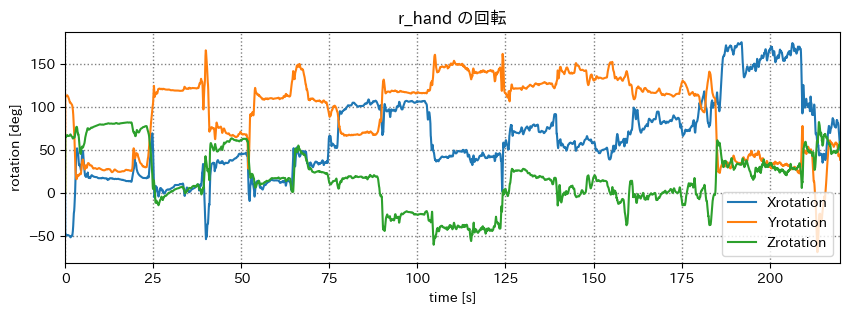
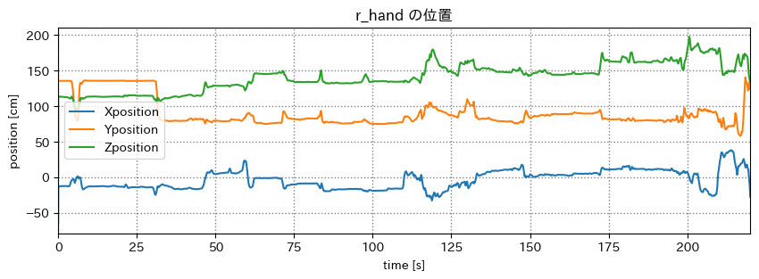
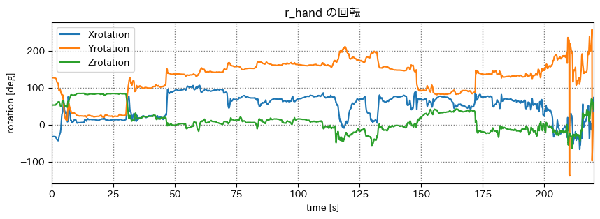

# mocopi センシング

## 出席率
- 3年セミナー：??%

## スケジュール
### 短期的な予定
- [ ] mocopi でセンシング
  - [x] mocopi x Unity
  - [x] 色んな動作をとる
  - [x] 誤差を計測(簡易)
  - [x] 動作をグラフ化
  - [x] bvhをパースするパッケージを作る
  - [x] csv に書き出せるアプリを作る
  - [x] 複数人の絡みを取ってみる
  - [ ] 動作判別
- [ ] 研究をしたい
  - [ ] テーマを考える
  - [ ] 研究する
  - [ ] 論文を書く
  - [ ] 発表する

### 長期的な予定
- 1月~ 研究
- 12月 WiNF2024

## 進捗報告
## ジュニア会員のなり方がわからない
なれた！

## mocopi でセンシング
### ツイスターゲームをやってみた
第一回戦
<iframe width="1170" height="692" src="https://www.youtube.com/embed/KASybmyXets" title="ツイスターゲーム mocopi 第一回戦" frameborder="0" allow="accelerometer; autoplay; clipboard-write; encrypted-media; gyroscope; picture-in-picture; web-share" allowfullscreen></iframe>

第二回戦
<iframe width="1042" height="586" src="https://www.youtube.com/embed/kJt86SCisUU" title="ツイスターゲーム mocopi 第二回戦" frameborder="0" allow="accelerometer; autoplay; clipboard-write; encrypted-media; gyroscope; picture-in-picture; web-share" allowfullscreen></iframe>

### 位置と回転のグラフ
お互いスタート地点に立って開始した

#### root(腰) プレイヤー1

#### root(腰) プレイヤー2

### r_hand(右手) プレイヤー1

### r_hand(右手) プレイヤー2

- 後半に揺れが大きくなっているのがわかる
- それぞれのターンで姿勢が変わっているのがわかる
    - どれだけ動いているかとれそう
- グラフからは状況がわからない
    - 二人の絡みなど

### BVH Sender で表示
<iframe width="1042" height="586" src="https://www.youtube.com/embed/qkCMd2rb3y4" title="ツイスターゲーム　第一回戦 mocopi" frameborder="0" allow="accelerometer; autoplay; clipboard-write; encrypted-media; gyroscope; picture-in-picture; web-share" allowfullscreen></iframe>

（編集で横並びにしています）

- 簡単に動作を確認したい
- 複数人を同時に表示したい
- リアルタイムで表示と保存をしたい

今後のために動作を確認できるものを制作する

目標がないため、mocopi で目指すところを考えたい

## 進路関係
なし

## 余談
### (就活を前提とした) webの勉強を本格的に始めた
「スマホアプリも触れる」 から  「web一筋」 に路線変更

#### シス研のサイトを作り直した
<iframe src="https://sysken.net/" width="100%" height="500px"></iframe>

デザインは旧バージョンと同じ

- panda css (CSSinJS) を触れた
- Next14(AppRouter) と Static Export (静的レンダリング) を使った
- コンポーネントの分け方を意識した
    - 汎用性が高くなるようにした
    - テストが書きやすい構造にした
- AppRouter に合わせたアーキテクチャにした
- ESLint と Prettier で統一的な書き方になるようにした
- issuesを活用してブランチを使い分けるようにした
- etc.

#### 今後
- さまざまなcssライブラリを使う
- アーキテクチャを知る
- 良いコンポーネントの書き方を学ぶ
- 良いcssの書き方を学ぶ
- テストコードを書く
- バックエンドをもっと勉強する
- クラウド (AWS・GCP) に慣れる

これを踏まえた上で、何か大きめのプロダクトを制作し継続的な開発をしたい

# メモ
梶先生の言っていた事メモ
- コンサルタントを目指して欲しい（頂上は accenture）
- webと医療だとか新しく自分のものにしていって提案できるような人を育成したい
- 今の梶研は目先の技術力を身につけていいところに行けちゃってい
- 組み合わせは、技術同士だけでなく趣味とか色々なんでも

※ たくさん言われて抜けていることありそう  
※ 難しくて解釈違いがあるかも  
