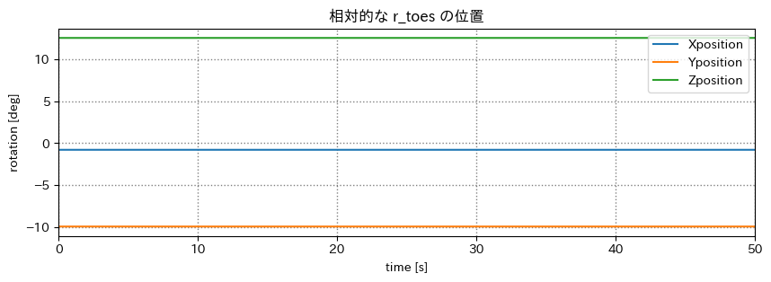
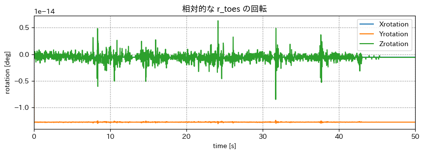
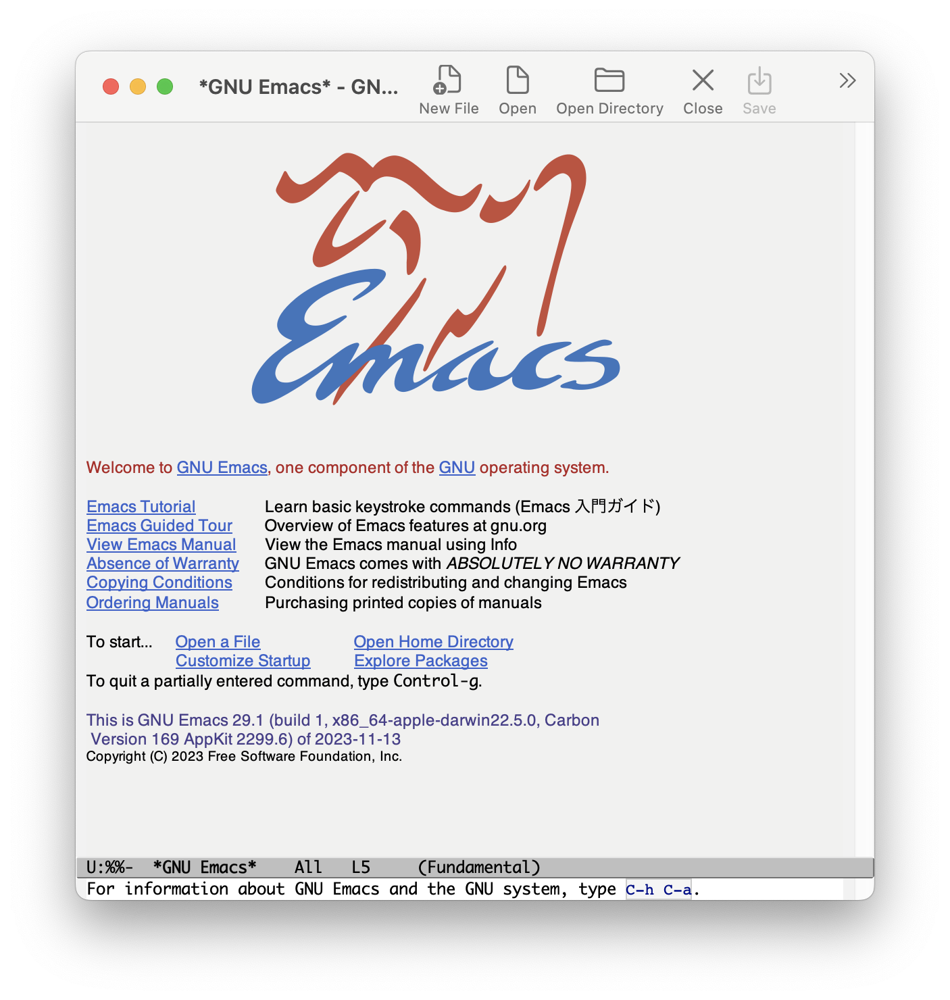
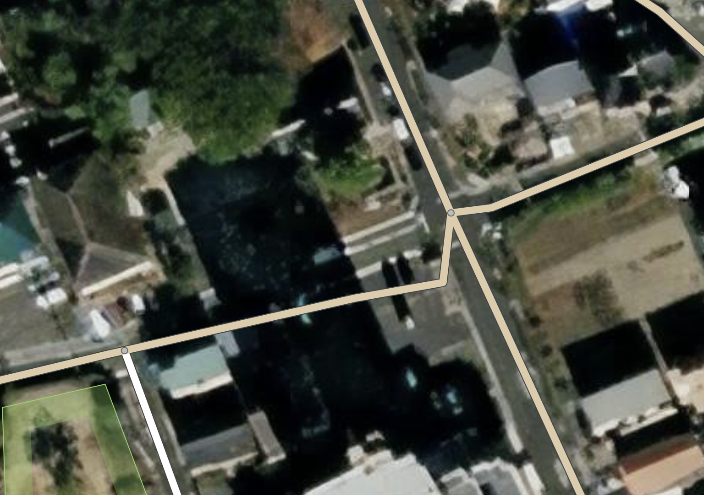
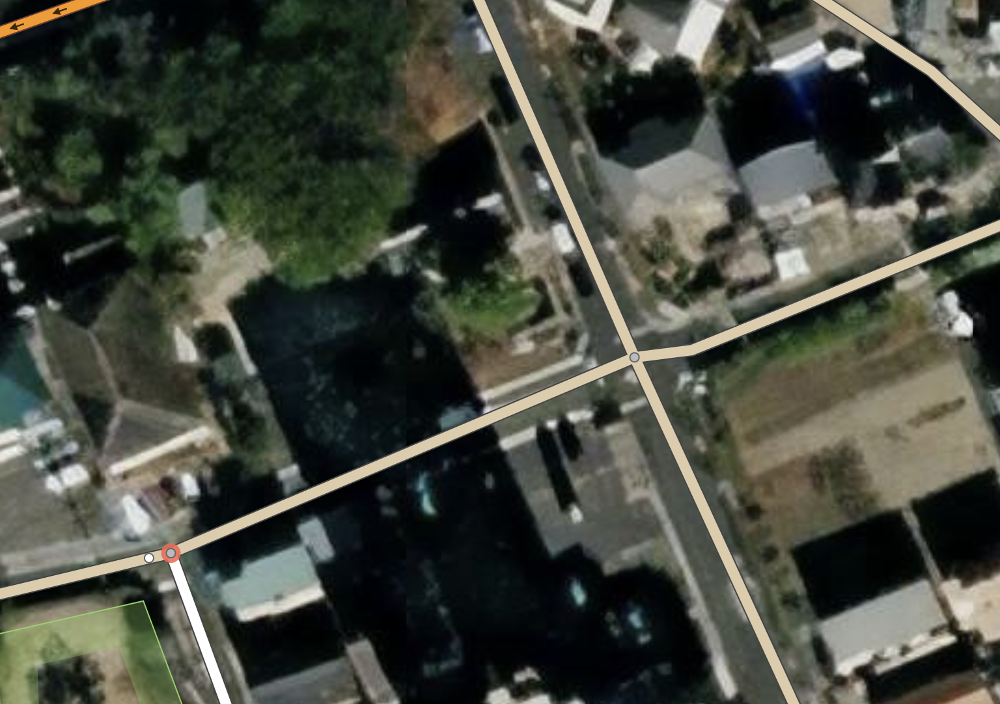
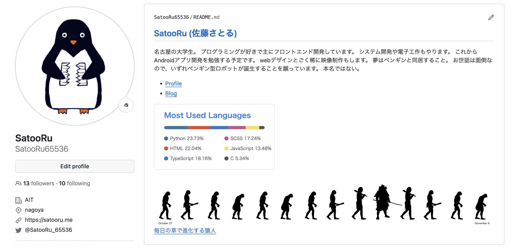
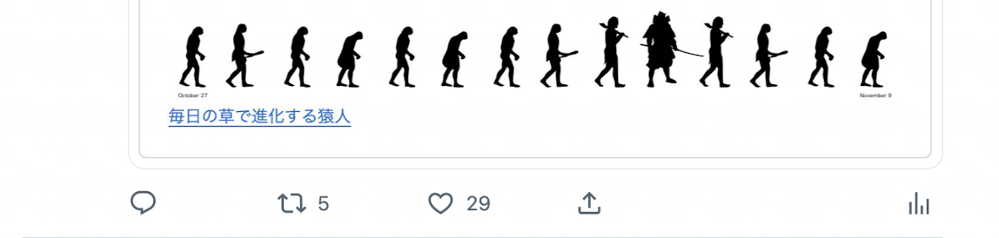

# mocopi センシング

## スケジュール
### 短期的な予定
- [ ] mocopi でセンシング
  - [x] mocopi x Unity
  - [x] 色んな動作をとる
  - [x] 誤差を計測(簡易)
  - [x] 動作をグラフ化
  - [x] bvhをパースするパッケージを作る
  - [ ] 動作判別
  - [x] csv に書き出せるアプリを作る
  - [ ] 複数人の絡みを取ってみる
- [ ] 研究をしたい
  - [ ] テーマを考える
  - [ ] 研究する
  - [ ] 論文を書く
  - [ ] 発表する
### 長期的な予定
- 1月~ 研究
- 12月 WiNF2024

## 進捗
## "地図は意外とウソつき" を読んだ
~~Twitter~~ **X** で気になっていたものが梶研にあったから読んだ。

## ジュニア会員のなり方がわからない
前に情報処理学会で "学生会員" で申し込んで、放置してたら金曜日に請求がきた。
ジュニア会員に変更したいが分からない

## bvhをパースするパッケージを作った
これから簡単にmocopiの動作をとれるようにする

- 骨格情報をbvhファイルから取得するように変更した
- 骨格情報を変更できるようにした
- bvhファイルをパースして Dataframe として扱えるようにした
- 初期位置/回転量を変更できるようにした
- モーションデータを変更できるようにした
- csv に書き出せるようにした
- Dataframe から bvhファイルに書き出せるようにした

### PYPI に登録した
#### インストール
```shell
$ pip install mcp_persor
```

#### インポート
```shell
from mcp_persor import BVHparser
```


### BVHファイルから取得
```python
bvhp = BVHparser('bvh/mocopi-move.bvh')
motion_df = bvhp.get_motion_df()
```

#### 前回からの進捗
関節名やファイル構造を知っている前提で、パースしていたが、  
全ての情報をBVHファイルから取得するようにした


### 骨格情報を変更できるようにする
```python
offset = bvhp.get_joint_offset('r_hand')
offset[0] += 10
bvhp.set_joint_offset('r_hand', offset)
```

人の体に合わせて変更でき、より正確な動作になる


### bvhファイルをパースして Dataframe として扱えるようにする
#### 相対的(接続する関節が基準)
```python
relative_motion_df = bvhp.get_joint_motion_df(joint_name, mode='relative')
```


#### 絶対的(世界座標が基準)
```python
relative_motion_df = bvhp.get_joint_motion_df(joint_name, mode='absolute')
```



### 初期位置/回転量を変更できるようにする
```python
init_pos = bvhp.get_initial_position()
init_rot = bvhp.get_initial_rotation()

bvhp.set_initial_position([0, 0, 0])
bvhp.set_initial_rotation([0, 0, 0])
```
動いてからデータの取得を開始しても補正できる。  
複数人での絡みをとった場合に補正できる。


### モーションデータを変更できるようにする
```python
# 取得
relative_motion_df = bvhp.get_joint_motion_df(joint_name, mode='relative')

# 変更
relative_motion_df['Xposition'] += 10

# セット
bvhp.set_joint_motion_df(joint_name, relative_motion_df, mode='relative')
```


### csv に書き出せるようにする
```python
bvhp.to_csv('mocopi-move.csv')
```

dataframe を扱っているから要らないけど、csv に書き出せるようにした


### Dataframe から bvhファイルに書き出せるようにする
```python
bvhp.to_bvh('mocopi-move.bvh')
```

調整等をしたあとに、bvhで書き出して確認をしたりできる


## 余談
### Emacs を入れてみた


キーバインドが気に入ってVScodeのキーバインドをEmacs風にした  
最終的に更にVScodeに依存することになった

### Open Street Map を編集してみた
思ったより面白くなかった





### 毎日の草で進化する猿人 API


csvを返すAPIを教えてたら作りたくなった。  
コントリビューションが前日以上であれば進化し、 前日未満であれば退化する



供養のつもりでポストしたら、思いの外好評だった。  
~~ハッカソンのネタ潰してごめんなさい~~




