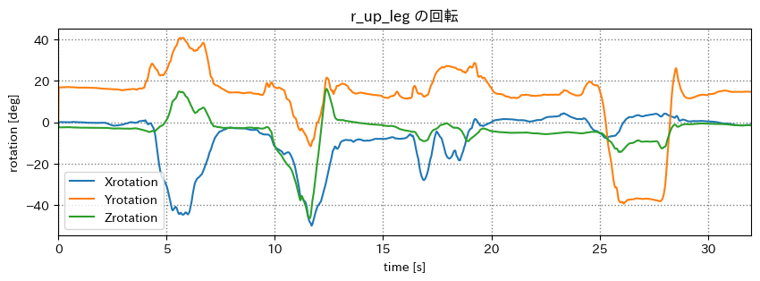
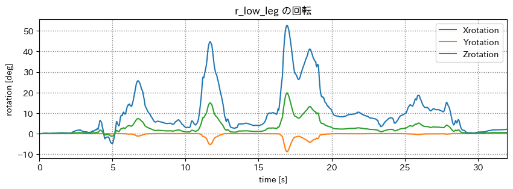
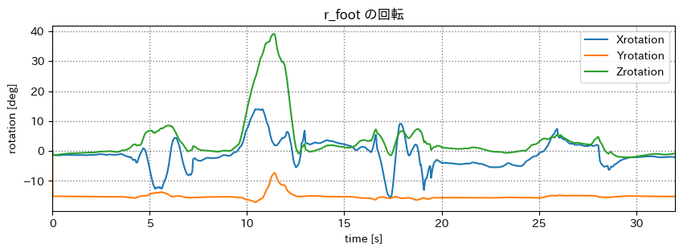
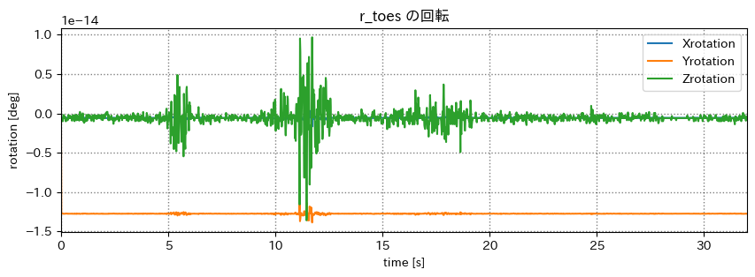

# mocopi センシング の環境を整える

## 出席率
- 3年セミナー：??%

## スケジュール
### 短期的な予定
- [ ] mocopi でセンシング
  - [x] mocopi x Unity
  - [x] 色んな動作をとる
  - [x] 誤差を計測(簡易)
  - [x] 動作をグラフ化
  - [x] bvhをパースするパッケージを作る
  - [x] csv に書き出せるアプリを作る
  - [x] 複数人の絡みを取ってみる
  - [ ] 複数人の動作を可視化できるアプリを作る
  - [ ] Unity で複数人の動作を可視化できるパッケージを作る
- [ ] 研究をしたい
  - [ ] テーマを考える
  - [ ] 研究する
  - [ ] 論文を書く
  - [ ] 発表する

### 長期的な予定
- 1月~ 研究
- 12月 WiNF2024

## 進捗報告
### 複数人の動作を可視化できるアプリを作る
mocopi と gLTF の関節と回転の対応が分からない  
→ 一部分だけ動かす

### データをとる
1. 右足を前にあげる
1. 右足を左にあげる
1. 右膝を曲げて上にあげる
1. 足をつけたまま回転する

### グラフ

タイムスタンプ取れば良かった

### 結果
r_up_leg: 足の付け根の回転  
r_low_leg: 膝の回転  
真上から見て
- 前へ: Xrotation(負)
- 右へ: Zrotation(負)
- 右回転: Yrotation(負)

r_foot: 足の付け根の回転  
- 不明

r_toes: 足の付け根の回転
- 不明

### 実装
<iframe width="1131" height="640" src="https://www.youtube.com/embed/5WHqWGrc_3w" title="mocopi x gLTF形式 下半身わからない" frameborder="0" allow="accelerometer; autoplay; clipboard-write; encrypted-media; gyroscope; picture-in-picture; web-share" allowfullscreen></iframe>

## 余談
### GReeeeN のライブに行った

いい写真は撮れませんでした.  
楽しめなかったので、良いセンシングできませんでした.  
(ずっと手叩いてただけ)

明日もライブに行くので、今度こそセンシングしたい.  

### DVDプレイヤーを買った
梶研でライブを見るために、DVDプレイヤーを買った.

