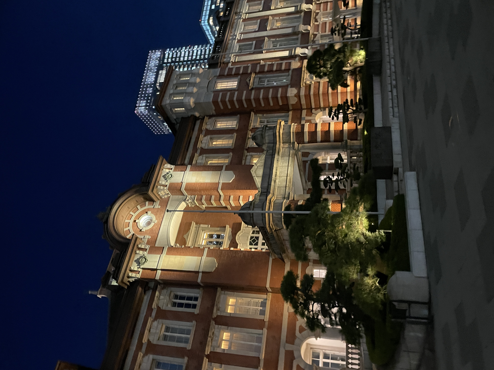
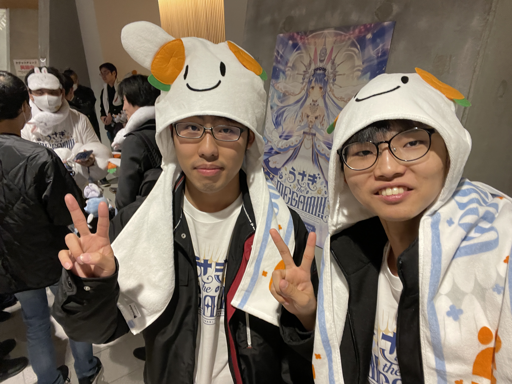
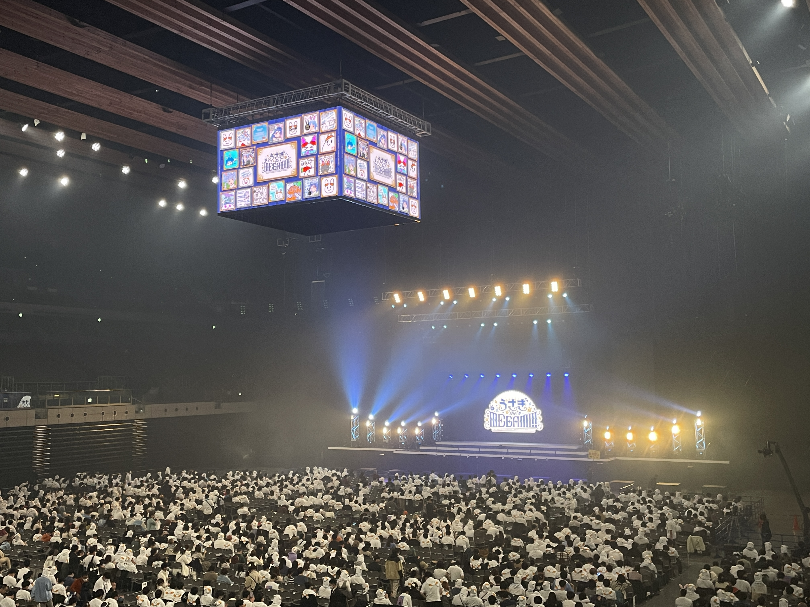
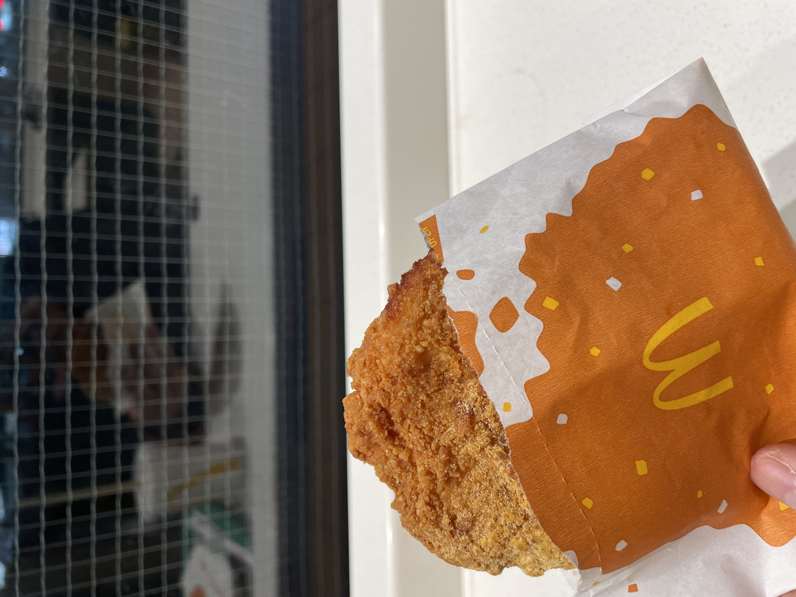
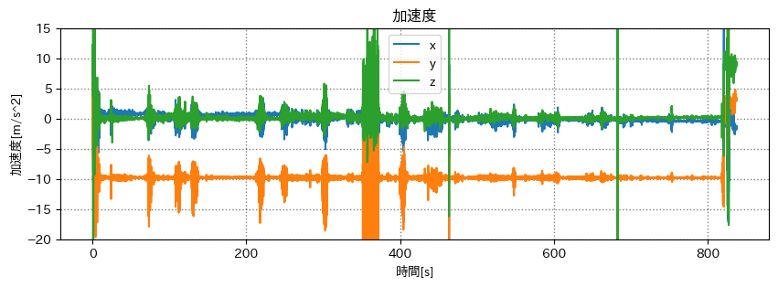
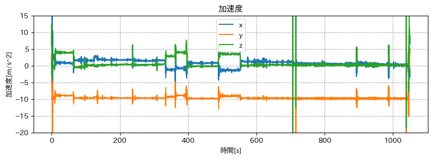

# mocopi センシング の環境を整える

## 出席率
- 3年セミナー：??%

## スケジュール
### 短期的な予定
- [ ] mocopi でセンシング
  - [x] mocopi x Unity
  - [x] 色んな動作をとる
  - [x] 誤差を計測(簡易)
  - [x] 動作をグラフ化
  - [x] bvhをパースするパッケージを作る
  - [x] csv に書き出せるアプリを作る
  - [x] 複数人の絡みを取ってみる
  - [ ] 複数人の動作を可視化できるアプリを作る
  - [ ] Unity で複数人の動作を可視化できるパッケージを作る

## 進捗報告
### 目標
mocopiで研究するときの環境を整えたい.
- [x] BVH を Python で扱いやすいように
- [x] ブラウザで動作を確認できるようにする(gLTF形式の理解)
- [ ] Unityで動作を確認できるようにする

### 現在の BVH を再生できるものの問題点
- 初期位置・向きが指定できない
- Unity で再生するとき、Blender で fbx に変換する必要がある
- **複数人の BVH を扱えない**

### BVH から gLTF形式 を動かすポイント
- BVH は 度数法, gLTF は 弧度法 を使っている
- X軸回転 と Z軸回転は 反対方向 になる
- 体全体(ROOT)のX回転は +180度 する

### 比較
#### BVH sender(SONY公式)
<iframe width="1173" height="660" src="https://www.youtube.com/embed/FWaQk5HC8gs" title="mocopi 下半身動かしたやつ(bvhsender)" frameborder="0" allow="accelerometer; autoplay; clipboard-write; encrypted-media; gyroscope; picture-in-picture; web-share" allowfullscreen></iframe>

#### mocopi viewer (自作)
<iframe width="1173" height="660" src="https://www.youtube.com/embed/3JpSi48gqu4" title="mocopi 下半身動かしたやつ(mocopi viewer)" frameborder="0" allow="accelerometer; autoplay; clipboard-write; encrypted-media; gyroscope; picture-in-picture; web-share" allowfullscreen></iframe>

### 問題点
- 複数再生はできるが、場合によっては時間がずれる
- カメラ移動が扱いずらい

ブラウザで動かすことが目標ではなく、
BVH からgLTF形式のモデルを動かすことはできたため、Unityでの可視化を進める

## 余談
### ぺこライブ に行ってきた

※ 温かかったです

- らららラビット
- 最強女神ウーサペコラ
- サインはB

- いいわけバニー
- 君の知らない物語
- 兎座ストーリー
