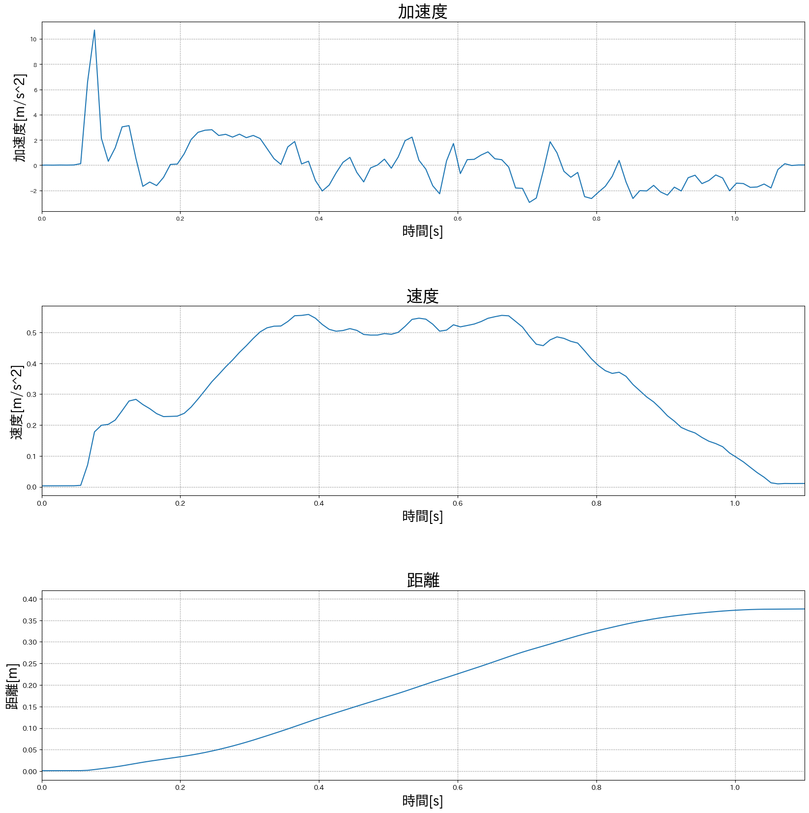
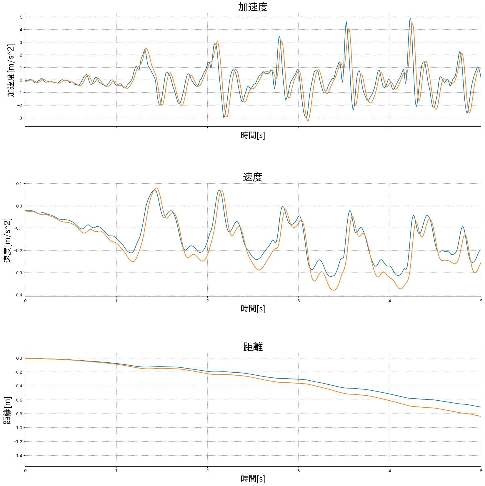
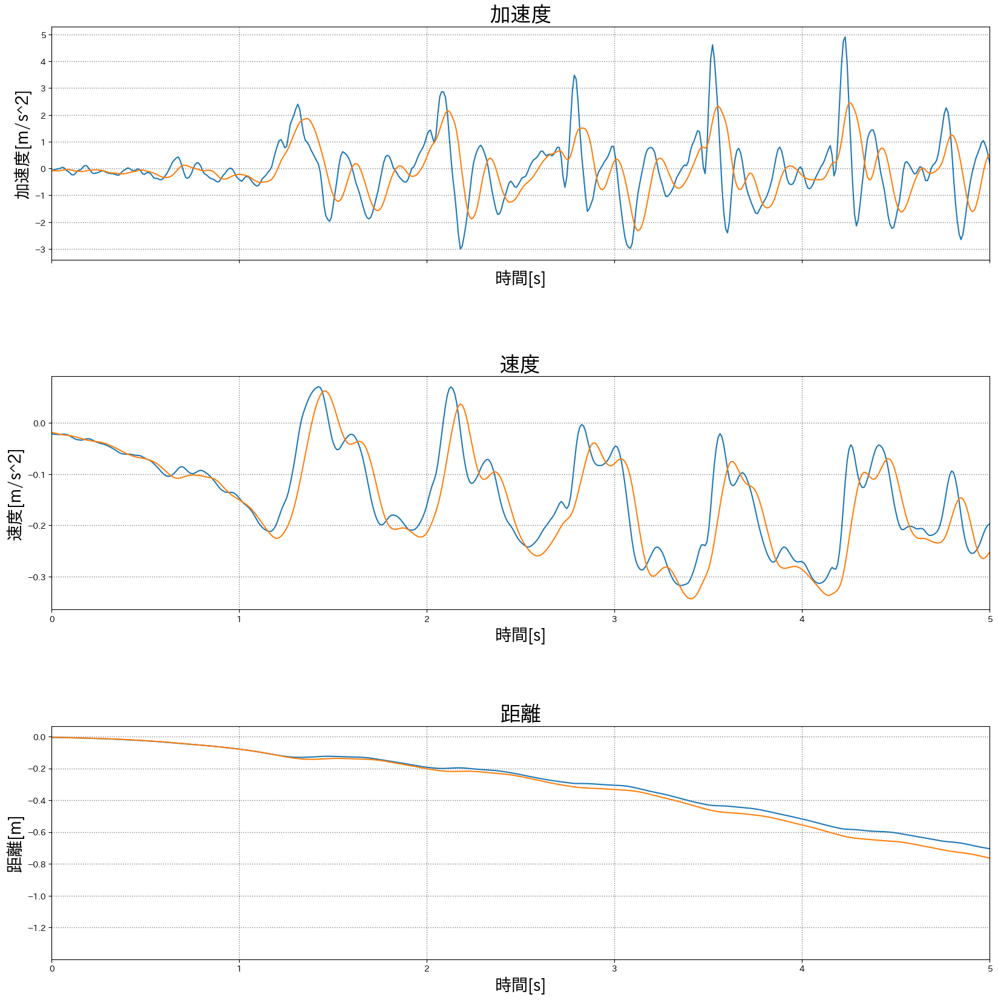
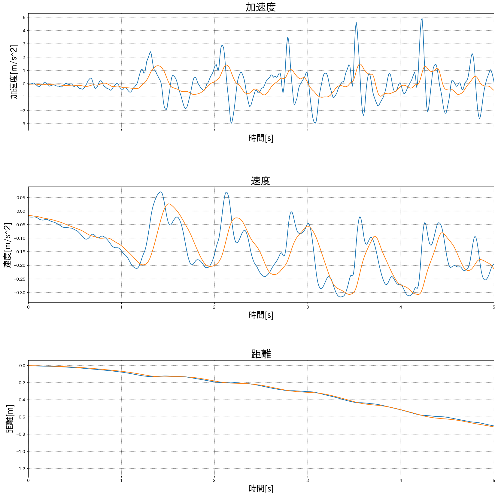
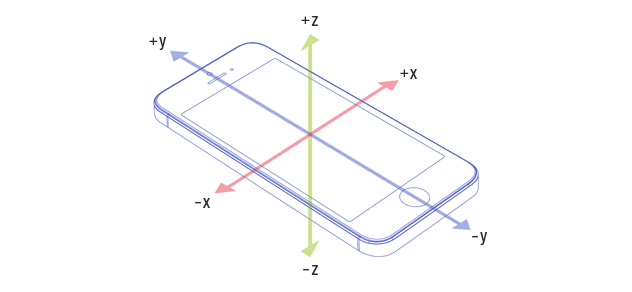

# スケジュール
- [x] Androidアプリ開発 お試し
  - [x] Android Stdio の設定
  - [x] 加速度センサーを見るアプリをつくる
  - [x] ファイル出力する
  - [x] ファイルをPCに移す
- 加速度から距離を出してみる
  - [x] 加速度センサーの値を取る(直線運動)
  - [x] Pythonでグラフ化する
  - [x] 加速度グラフを距離グラフにする
  - [x] 相対時間にする
- 歩数推定
  - [x] 加速度センサーの値を取る(歩行)
  - [ ] Pythonでグラフ化し、フィルターをかける
  - [ ] 歩数を取得する


# 進捗
## Androidアプリ開発 お試し
### 参考サイト
- [01_HelloAndroid](https://kjlb.esa.io/posts/2281)
- [02_Sensor](https://kjlb.esa.io/posts/2395)
- [03_Output](https://kjlb.esa.io/posts/2426)

### リポジトリ
[AndroidSensor](https://github.com/SatooRu65536/AndroidSensor)

### 変更点
- APIレベルに合わせたコードに変更
- `TextView` を行ごとに分割した

## 加速度から距離を出してみる
### 加速度センサーの値を取る
- スマホをx軸正の方向に約[TODO]cm動かした
- 環境
  - 端末
    - iPhone 12
  - センサー取得アプリ
    - phyphox

### Pythonでグラフ化する
- グラフ化
  - Python3.10.10
- 使用ライブラリ
  - pandas
  - matplotlib
  - numpy

### 加速度グラフを距離グラフにする
- `加速度[m/s^2]` を微分すると `速度[m/s]` になる
- `速度[m/s]` を微分すると `距離[m]` になる

#### 問題点
- 速度グラフ, 距離グラフ の形がおかしい
  - 微分 と 積分 を逆に認識していた
- 速度, 距離の値が大きすぎる
  - サンプリング周波数(100Hz)を考慮していなかった

### 最終的なグラフ


## 歩数推定
### 加速度センサーの値を取る(歩行)
- まっすぐ5歩
- スマホのz軸正が上向き、y軸正が左向きになるように腰の位置で手に持った

### Pythonでグラフ化し、フィルターをかける
#### 平滑化フィルター

> (N0 + N-1 + N-2 + N-3 + N-4) / 5

過去の値を使っています。  
(N0が現在の値)

サンプリング周波数が100Hzなので、5つの平均ではあまり意味がない?  
(n個の平均のnをwindowっていうのか...?)


> (N0 + N-1 + N-2 + ... + N-9) / 10

だいぶ滑らかになったが、1歩に対し頂点が複数ある


> (N0 + N-1 + N-2 + ... + N-19) / 20

1歩に対し1頂点になった。  
(平滑化フィルターだけでいいのだろうか)

過去との平均の為、波が大きく後ろにずれた。

やり方が違ったかも  
=> [歩数推定(esa)](https://kjlb.esa.io/posts/4114)

> data = pd.Series(np.random.randint(0, 10, size=20))
> rolling_mean = data.rolling(window=10).mean()

numpy で平滑化できるっぽい

# メモ
## センシング
1. とるデータを考える
2. データをとる
3. グラフ化
4. フィルターをかける(ノイズ除去)
5. ラベルをつける
6. アプリに落とし込む


- aphyphox
  - Androidのセンサーデータを取得するアプリ
- 積分(微分)すると情報が変わる
  - 加速度 -> 速度 -> 距離
- 積分にも種類がある
  - 目的によって使い分ける
  - 台形積分, etc.
- 加速度センサーの向き[図1]
  - 右: +x
  - 上: +y
  - 表: +z

### 図1



# 単語帳
### ノルム
携帯の持ち方による違いなどをなくす  
> ベクトル量で表される加速度をx軸、y軸、z軸の成分に分解し、それぞれの成分の二乗を足し合わせたものの平方根


```
√(ax^2 + ay^2 + az^2)
```

## フィルター
- 牧野先輩に聞く

### ローパスフィルター
小さいデータを取り出す  
low を pass する(小さいのを通過させる)

[tomoima525's blog](https://tomoima525.hatenablog.com/entry/2014/01/13/152559)
> ローパスフィルタの式  
> S[t]= α*Y[t-1] + (1-α)*S[t-1]

### ハイパスフィルター
尖ったものを取り出す  
- 平均フィルター

### バンドパスフィルタ
間のものを取り出す
